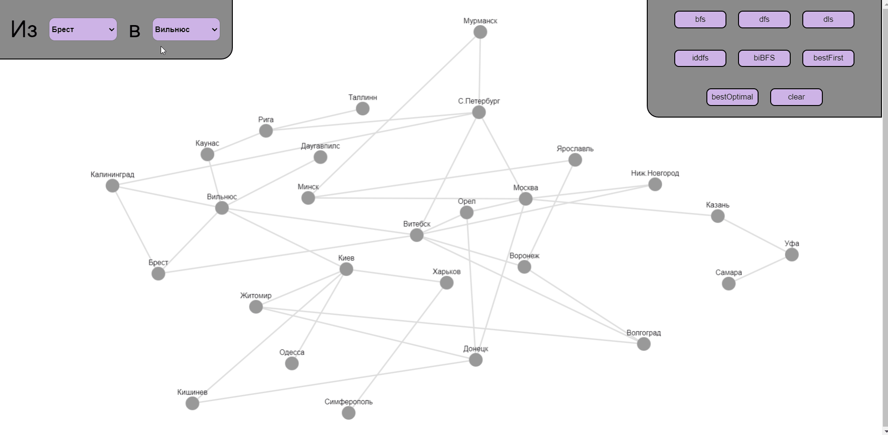

# Изучение алгоритмов поиска пути в графе
## Демонстрация работы сайта

## Пояснения к кнопкам
**Неинформированный поиск (длина пути между станциями НЕ учитывается):**

_bfs_ - поиск в ширину;

_dfs_ - поиск глубину;

_dls_ - поиск с ограничением глубины равным 5;

_iddfs_ - поиск с итеративным углублением; 

_biBFS_ - двунаправленный поиск.

**Информированный поиск (длина пути между станциями учитывается):**

_bestFirst_ - жадный поиск по первому наилучшему соответствию;

_bestOptimal_ - поиск методом минимизации суммарной оценки А*.

**Прочее:**

_clear_ - Отчистка.

## Пояснения к цветам вершин и ребер
_Серый_ - не просмотрен.

_Синий_ - просмотрен.

_Красный_ - начало.

_Зеленый_ - конец.

_Черный_ - найденный путь.